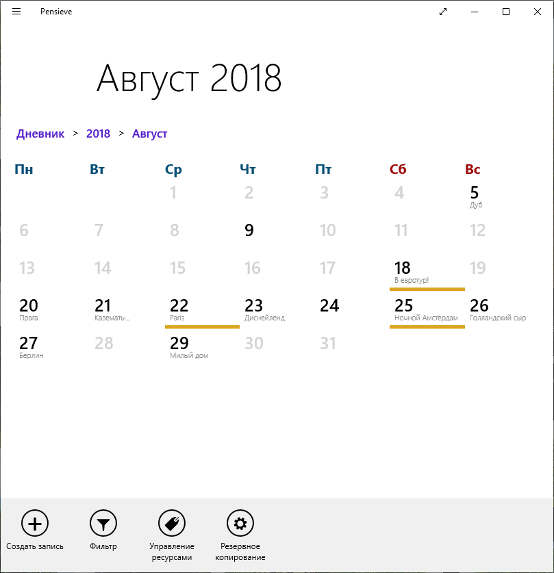
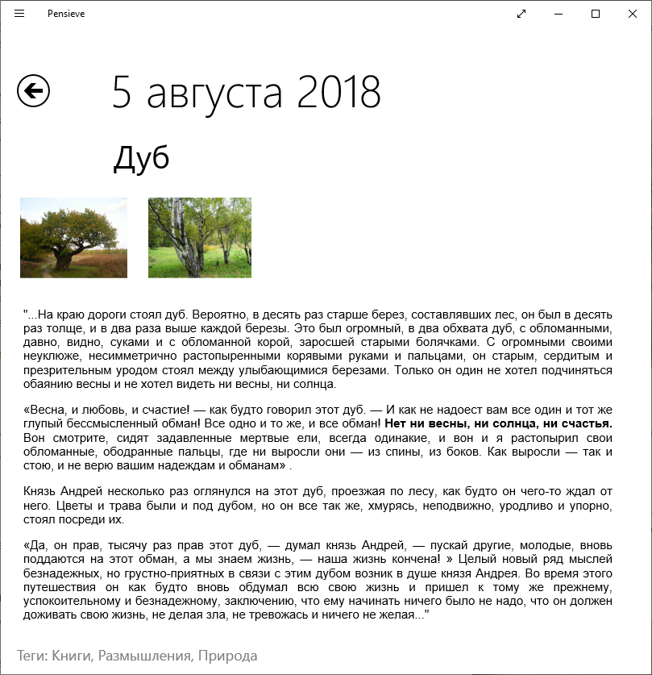

<table>
   <tr>
      <td></td>
      <td><h1>Pensieve</h1></td>
   </tr>
</table>

Дневник для Windows 8/8.1/10 Store, который позволяет:

- Сохранять, редактировать и просматривать записи, привязанные к определённой дате
- Использовать HTML-разметку, прикреплять тэги, фото, музыку и документы из локального хранилища
- Проводить поиск по содержанию и ключевым словам, фильтрацию по важности записей
- Контролировать данные - проводить резервное копирование SQLite базы данных и ресурсов в формате zip-архива

<table>
   <tr>
      <td></td>
      <td></td>
   </tr>
</table>

## Использованные технологии

- Windows 8.1 SDK
- SQLite

## Установка из .appx

1. Установить сертификат из папки AppPackages в "Локальная машина" -> "Доверенные лица"
2. Установить пакеты Microsoft.VCLibs и Pensieve

## Сборка

Для сборки потребуется:

1. Среда с поддержкой разработки приложений для Windows 8.1 Store (начиная с Visual Studio 2017 поддержка прекращена)
2. Установленный пакет Windows 8.1 SDK.
3. Восстановить пакеты NuGet, от которых зависит проект: `nuget restore Pensieve.sln`
